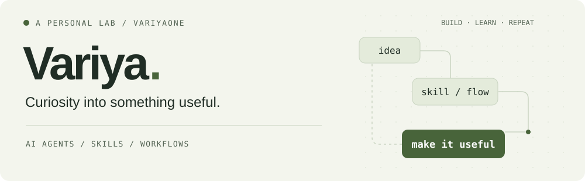

<picture>
  <source media="(prefers-color-scheme: dark)" srcset="./assets/header-dark.svg">
  <source media="(prefers-color-scheme: light)" srcset="./assets/header-light.svg">
  
</picture>

<h1>Hi, I'm Variya.</h1>

<strong>让 AI 不止会回答，更能把事情做完。</strong>

我把日常工作里的问题，做成 AI 工具、Skills 和工作流。这里记录我的动手实验：从技能创建、人格化 Agent，到简历筛选和自主编程。比起一段漂亮的回答，我更关心它能不能走完一个真实任务。

<em>Building practical AI tools, reusable skills, and workflows that turn ideas into working things.</em>

  <a href="#selected-work">精选项目</a> ·
  <a href="#what-im-exploring">探索方向</a> ·
  <a href="#elsewhere">在别处找到我</a>

<h2 id="selected-work">一些动手留下的东西</h2>

<ul>
  <li><a href="https://github.com/Variyaone/skill-forge"><strong>Skill Forge</strong></a> — 创建、检查和打包可复用的 AI Skills。</li>
  <li><a href="https://github.com/Variyaone/Necromancy"><strong>Necromancy · 拘灵遣将</strong></a> — 将记忆、语言风格与人物特征组织为人格化 Skill / Agent。</li>
  <li><a href="https://github.com/Variyaone/resume-screener"><strong>Resume Screener</strong></a> — 梳理岗位需求，辅助简历筛选与面试反馈记录。</li>
  <li><a href="https://github.com/Variyaone/a-stock-advisor"><strong>A-Stock Advisor</strong></a> — 以 A 股研究为场景，测试 AI 拆解任务和自主编程。</li>
  <li><a href="https://github.com/Variyaone/WildQuest-Matrix"><strong>WildQuest Matrix</strong></a> — 数据、因子、回测与风控的量化研究实验。</li>
  <li><a href="https://github.com/Variyaone/variya-xhs-openskill01"><strong>OpenSkill 01</strong></a> — 内容创作、个人效率和工作流程的技能集合。</li>
  <li><a href="https://github.com/Variyaone/JoyCode2Api"><strong>JoyCode2Api</strong></a> — JoyCode 与 Anthropic / OpenAI 格式的协议适配；Fork 自 <a href="https://github.com/vibe-coding-labs/JoyCode2Api">vibe-coding-labs/JoyCode2Api</a>。</li>
</ul>

<h2 id="what-im-exploring">02 / What I'm exploring</h2>

<ul>
  <li><strong>从 Prompt 到 Workflow</strong>：让 AI 拆解、执行和跟踪任务，而不是每一步都等人提醒。</li>
  <li><strong>从一次使用到反复复用</strong>：把方法、工具和上下文沉淀成 Skills。</li>
  <li><strong>从通用回答到具体场景</strong>：在工作、创作与研究中，检验 AI 到底帮上了什么忙。</li>
</ul>

<h2 id="elsewhere">03 / Elsewhere</h2>

代码放在这里，也在这些地方分享：

<ul>
  <li><strong>影响力动物</strong> — 公众号 · 知乎 · 抖音</li>
  <li><strong>小王，过来一下</strong> — 小红书</li>
</ul>

如果你试用了某个项目，欢迎在对应仓库的 Issues 里留下具体场景、问题或改进建议。

保持好奇，把想法做出来。 Stay curious. Make it useful.

